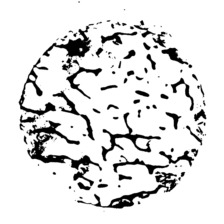
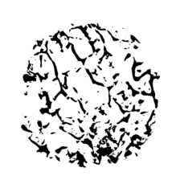

# Bone-Defect-Classification

## 0. Data and Conda Env.
- Fine Bone 

- Broke Bone


- Conda Env.
	- Python 3.5up
	- Pytorch
	- torchvision
	- shutil
	- matplotlib
	- PIL

## 1. Split Data
- Data
	- Fine (1332x1330)
	- Broke (1332x1330)

using ([split_data.ipynb](./split_data.ipynb)), then data will be splited as follows:
- Train (90%)
	- Fine (224x224)
	- Broke (224x224)
- Test (10%)
	- Fine (224x224)
	- Broke (224x224)

if you want to modify testing data ratio as x : 
```
split_ratio = x
```

### 2. Train model 

```
$ python train.py --model=[selet_model]
```
```
select_model = [ resnet18, convnet ]
```
then model weight will save in **weights** folder <br />

ps. Training model test accuracy = **100%** 

### 3. Inference model
Put image into folder **[/defect/run/]**

```
$python run.py --model=[selet_model]
```
```
select_model = [ resnet18, convnet ]
```

After inferencing, the images in **run** will be automated removing into  **[/defect/run_Fine/]** or **[/defect/run_Broke/]** by their predicted results.

### 4. Other works
- Data Augmentation : ([augmentation.ipynb](./augmentation.ipynb))
